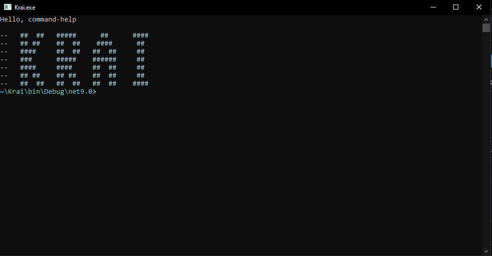

# Krai_Terminal.cs


A custom terminal with command and file handling support written in C#.

## 🌟 Features
- Support for basic commands (`cd`, `ls`, `clear`, `exit`)
- Open and edit files via context menu
- Highlight current directory and Git branch (if available)
- Cross-platform (Windows/Linux/macOS)
- Color-coded error and hints output
- Also supports git


| Commands | Description |
| - | - |
| `help` | show this help |
| `clear` | Clear screen |
| `exit` | Exit the terminal |
| `neofetch` | Show system info |
| `ls` | file list |
| `dir` | file list |
| `cd` | file transfer |

##  ✍️ Edit code

`All languages`
- **Arrows** - line navigation
- **Enter** - new line
- **Backspace** - delete a character
- **Ctrl+S** - save
- **Esc** - exit without saving - **Esc** - exit without saving

# 💸 Supports

[](https://buymeacoffee.com/kreofotimio)
Binance(BTC):12gnSfx6wRHJa7tYpB8JdBJ85gW3i5p9yZ

# 🔨Build from source
```bash
git clone https://github.com/ваш-username/MyTerminal.git
cd MyTerminal
dotnet publish -c Release -r win-x64 --self-contained true
```
# 📂 Project structure
```
MyTerminal/
├── Commands/       # Realizations of commands
├── Program.cs      # Entry point
├── Terminal.cs     # Basic logic
├── MyTerminal.csproj
└── Krai.exe        #Starting the terminal
```
#  🔧Starting the terminal
```
Krai.exe
```
If you're not running Krai.exe.Go to the console and type this command:
```bash
dotnet build
```
The executable file will appear in the folder:
```
Krai_Terminal.cs\bin\Debug\net9.0\Krai.exe
```
## Russian translation
[](https://github.com/kreofox/Krai_Terminal.cs/tree/main/Document)
